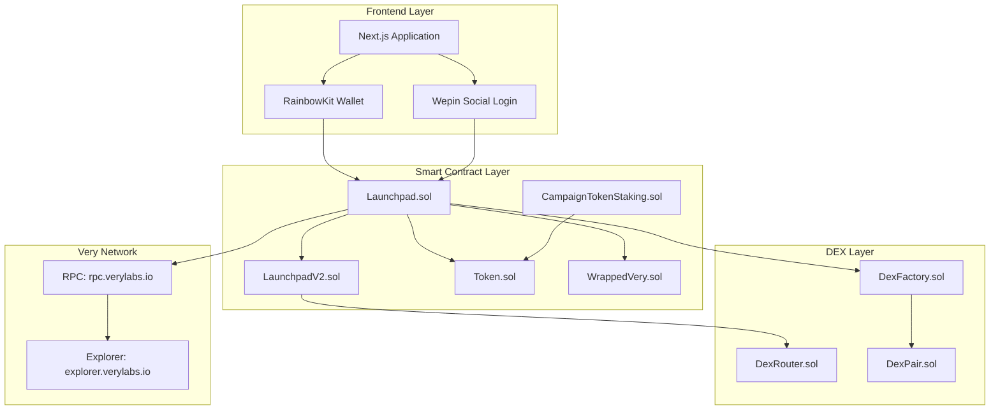
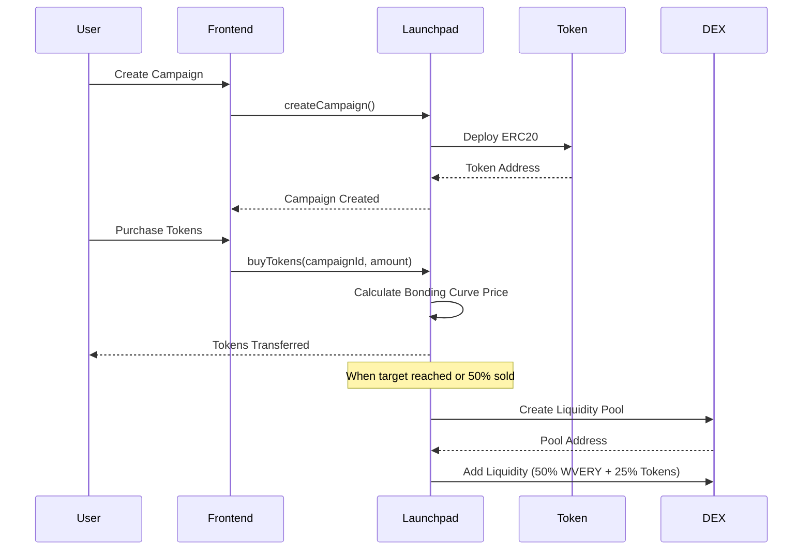
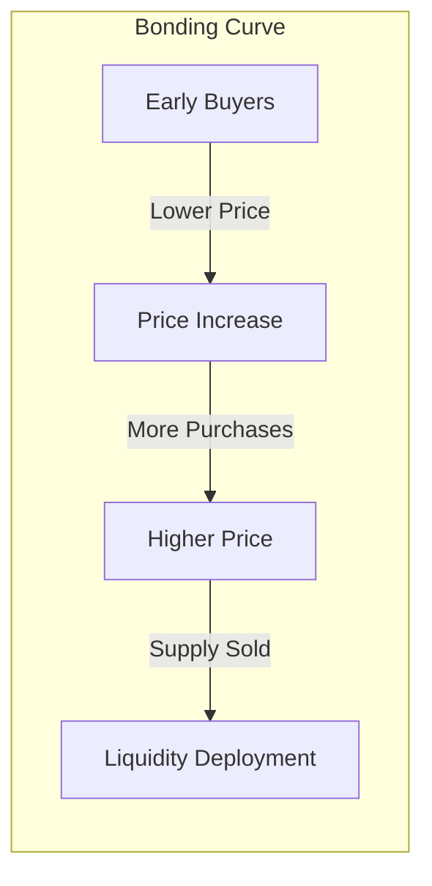

# VeryLaunch

<p align="center">
  
  
  
</p>

<p align="center">
  <strong>A Decentralized Token Launchpad with Instant Liquidity on Very Network</strong>
</p>

<p align="center">
  <a href="https://github.com/Blockchain-Oracle/very-launch">GitHub</a> |
  <a href="https://explorer.verylabs.io">Very Explorer</a>
</p>

---

## Overview

VeryLaunch is a decentralized launchpad platform that enables fair and transparent token launches with guaranteed instant liquidity. Built for the Very Network Hackathon, the platform leverages Bancor-style bonding curves and automated liquidity provision to create a trustless fundraising environment.

Traditional token launches suffer from several critical issues: delayed liquidity causing price manipulation, unfair distribution favoring insiders, and lack of transparency in fund allocation. VeryLaunch addresses these challenges through smart contract automation that guarantees liquidity deployment, implements fair pricing through mathematical curves, and provides complete on-chain transparency.

---

## Problem Statement

The current token launch ecosystem faces fundamental challenges:

1. **Liquidity Fragmentation**: New tokens often launch without sufficient liquidity, leading to extreme volatility and manipulation opportunities
2. **Unfair Distribution**: Early access and preferential pricing create asymmetric advantages for connected participants
3. **Trust Deficit**: Manual liquidity provision and opaque fund management erode investor confidence
4. **Failed Campaigns**: Contributors to unsuccessful launches often lose funds with no recourse

VeryLaunch solves these problems through deterministic smart contracts that automate the entire launch lifecycle.

---

## Architecture



### Component Interaction Flow



---

## Bonding Curve Mechanism

VeryLaunch implements a Bancor-style bonding curve that mathematically determines token prices based on supply:



The bonding curve formula ensures:

- **Early Incentivization**: First participants receive more tokens per WVERY spent
- **Price Discovery**: Market-driven pricing through mathematical determinism
- **Fair Distribution**: No preferential access; price depends solely on purchase timing

---

## Smart Contracts

### Core Contracts

| Contract | Purpose |
|----------|---------|
| `Launchpad.sol` | Campaign creation, funding logic, bonding curve calculations |
| `LaunchpadV2.sol` | Enhanced OG points distribution, swap functionality post-launch |
| `Token.sol` | ERC20 token factory for campaign-specific tokens |
| `WrappedVery.sol` | WVERY token (6 decimals) for platform transactions |
| `CampaignTokenStaking.sol` | Token staking with configurable APY |

### DEX Contracts

| Contract | Purpose |
|----------|---------|
| `DexFactory.sol` | Liquidity pair creation factory |
| `DexPair.sol` | Individual liquidity pool implementation |
| `DexRouter.sol` | Swap routing and liquidity management |

---

## Key Features

### Instant Liquidity Deployment

Liquidity is automatically deployed when either condition is met:
- Campaign reaches target raise amount
- 50% of token supply is sold

The deployment allocates:
- 50% of raised WVERY to liquidity pool
- 25% of total token supply paired with WVERY

### Refund Mechanism

Contributors can claim full refunds if:
- Campaign is cancelled by creator
- Funding deadline passes without meeting goals

### OG Points System

Platform participation earns OG points:
- 30% of platform fees distributed to high OG point holders
- Points earned through campaign participation
- Incentivizes long-term platform engagement

### Multi-Wallet Support

- **RainbowKit**: MetaMask, WalletConnect, Coinbase Wallet
- **Wepin**: Social login via Google/Apple OAuth

---

## Technology Stack

### Frontend
- Next.js 14 (App Router)
- TypeScript
- Tailwind CSS
- RainbowKit / Wagmi
- Viem

### Smart Contracts
- Solidity 0.8.x
- Foundry / Hardhat
- OpenZeppelin Contracts

### Network
- Very Network (Chain ID: 4613)
- Local Development: Anvil (Chain ID: 31337)

---

## Project Structure

```
VeryLaunch/
├── packages/
│   ├── hardhat/
│   │   ├── contracts/
│   │   │   ├── Launchpad.sol
│   │   │   ├── LaunchpadV2.sol
│   │   │   ├── Token.sol
│   │   │   ├── WrappedVery.sol
│   │   │   ├── CampaignTokenStaking.sol
│   │   │   └── bumdex/
│   │   │       ├── DexFactory.sol
│   │   │       ├── DexPair.sol
│   │   │       └── DexRouter.sol
│   │   ├── deploy/
│   │   ├── scripts/
│   │   └── test/
│   └── nextjs/
│       ├── app/
│       │   ├── app/
│       │   │   ├── campaign/
│       │   │   ├── explore/
│       │   │   └── roadmap/
│       │   └── blockexplorer/
│       ├── components/
│       ├── contracts/
│       ├── hooks/
│       └── utils/
└── README.md
```

---

## Getting Started

### Prerequisites

- Node.js v20.18.3 or later
- pnpm (recommended) or Yarn v3.2.3
- Git

### Installation

1. Clone the repository:

```bash
git clone https://github.com/Blockchain-Oracle/very-launch.git
cd very-launch
```

2. Install dependencies:

```bash
pnpm install
```

3. Start local blockchain:

```bash
pnpm chain
```

4. Deploy contracts (new terminal):

```bash
pnpm deploy
```

5. Start frontend (new terminal):

```bash
pnpm start
```

6. Open http://localhost:3000

### Environment Configuration

Create `.env` files in respective packages:

**packages/hardhat/.env**
```
DEPLOYER_PRIVATE_KEY=your_private_key
```

**packages/nextjs/.env.local**
```
# WalletConnect - Get from https://cloud.walletconnect.com
NEXT_PUBLIC_WALLET_CONNECT_PROJECT_ID=your_project_id

# Wepin Social Login - Get from https://workspace.wepin.io
NEXT_PUBLIC_WEPIN_APP_ID=your_wepin_app_id
NEXT_PUBLIC_WEPIN_APP_KEY=your_wepin_app_key
```

---

## Network Configuration

| Network | Chain ID | RPC URL | Explorer |
|---------|----------|---------|----------|
| Very Network | 4613 | https://rpc.verylabs.io | https://explorer.verylabs.io |
| Anvil Local | 31337 | http://127.0.0.1:8545 | - |

---

## Testing

Run smart contract tests:

```bash
pnpm hardhat:test
```

Run full development flow:

```bash
cd packages/hardhat
pnpm hardhat run scripts/setup-full-dev-environment.ts --network localhost
```

---

## Deployment

Deploy to Very Network:

```bash
pnpm deploy --network veryMainnet
```

---

## Roadmap

### Phase 1: Core Launch (Current)
- Campaign creation and funding
- Bonding curve token sales
- Automated liquidity deployment
- Refund mechanism

### Phase 2: Enhanced Features
- Token staking pools
- OG points distribution
- Advanced analytics dashboard

### Phase 3: Ecosystem Growth
- Cross-chain bridge integration
- Governance token launch
- DAO treasury management

---

## License

MIT License

---

## Acknowledgments

Built for the Very Network Hackathon 2025.
